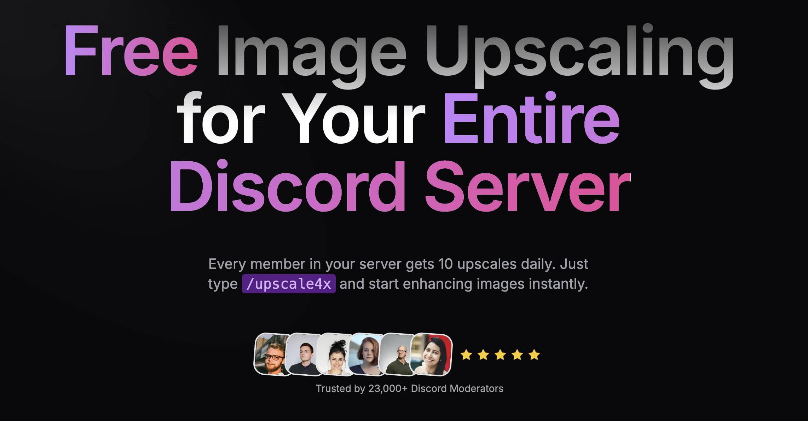

# Best Bots for Organizing and Sharing Images in a Discord Server

Discord communities often share a wealth of images, memes, and artwork. To streamline organization and sharing, several bots stand out for their features and ease of use. Below is a comparison of the best Discord bots for managing and sharing images.

## Popular Bots

### **Photokeep**
- **Features**:
  - Image storage and folder-based organization.
  - Easy image retrieval with commands.
  - Random image selection for fun sharing.
  - Companion website for managing images.
- **Ease of Use**: Intuitive commands accessible via `///help`.
- **User Reviews**: Praised for practicality and focus on organization.
- **Pricing**: Free.

### **Cuddle**
- **Features**:
  - Image manipulation with filters and effects.
  - Fun commands like memes and random animal pictures.
  - Moderation tools for managing image content.
- **Ease of Use**: Customizable prefix (`c/`) and simple commands.
- **User Reviews**: Positive feedback for versatility and active development.
- **Pricing**: Free.

### **Atla**
- **Features**:
  - Image manipulation for meme creation.
  - Music player for social voice channel experiences.
  - Moderation tools and giveaway hosting.
- **Ease of Use**: User-friendly slash commands and default prefix (`t`).
- **User Reviews**: Generally positive, with some performance concerns.
- **Pricing**: Free.

### **Pepe Manager**
- **Features**:
  - Custom voice channel creation and management.
  - Meme creation and emoji management tools.
- **Ease of Use**: Straightforward commands with a default prefix (`p!`).
- **User Reviews**: Well-received for voice channel management.
- **Pricing**: Free.

### **<DSW> Bot**
- **Features**:
  - Image manipulation for memes and effects.
  - Gamified economy system with virtual currency.
  - Engaging games like PvP battles and typeracer.
  - Utility commands for quick information retrieval.
- **Ease of Use**: Simple commands with a default prefix (`*`).
- **User Reviews**: Praised for diverse features and active updates.
- **Pricing**: Free.

## Comparing the Bots
| Bot Name      | Image Organization | Image Sharing | Image Manipulation | Other Features                        | Pricing |
|---------------|--------------------|---------------|--------------------|---------------------------------------|---------|
| **Photokeep** | ✅ Folders, random image selection | ✅ Easy retrieval | ❌                    | Companion website                     | Free    |
| **Cuddle**    | ⚠️ Limited            | ✅             | ✅ Wide range of tools | Fun commands, moderation tools         | Free    |
| **Atla**      | ⚠️ Limited            | ✅             | ✅ Meme generation    | Music player, giveaways, moderation   | Free    |
| **Pepe Manager** | ⚠️ Limited         | ✅             | ✅ Meme creation      | Custom voice channels, emoji management | Free    |
| **<DSW> Bot** | ⚠️ Limited            | ✅             | ✅ Effects and memes  | Economy system, games, utility commands | Free    |

## Conclusion
The best bot for your server depends on your priorities:
- **Photokeep**: Ideal for communities focused on image organization and retrieval.
- **Cuddle**: Best for versatile image manipulation and fun server engagement.
- **Atla**: Perfect for all-in-one functionality with entertainment and moderation.
- **Pepe Manager**: Great for voice-channel-heavy servers.
- **<DSW> Bot**: Excellent for boosting engagement with games and an economy system.

Each bot offers unique features that cater to different community needs, ensuring a better experience for managing and sharing images on Discord.

## Featured Bot: PixEnhancer

### Free AI Image Upscaling for Discord Communities

PixEnhancer is an AI-powered Discord bot that provides free image upscaling for entire Discord communities. Every server member gets 10 free upscales daily, making it perfect for photography, art, gaming, and creative communities.

**Key Features:**

- 🎯 Free tier: 10 upscales/day per member
- 🚀 Simple command: `/upscale4x`
- 🖼️ Supports up to 8K resolution
- 📊 23,000+ Discord moderators trust us

Try it now: [PixEnhancer.com](https://www.pixenhancer.com/)

---

_Note: This resource is maintained by the PixEnhancer team. Feel free to star the repo if you found it helpful!_

